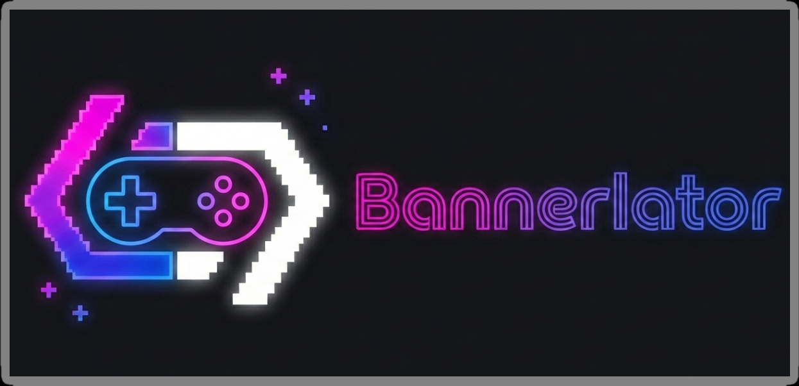

<p align="center">
  
</p>

<h1 align="center">Bannerlator</h1>
<p align="center"><b>Windows applications and games on Android.</b></p>

<p align="center">
  
  
  
  <a href="https://github.com/The412Banner/Bannerlator/issues/new?template=ask-the-ai.yml"></a>
</p>

<p align="center">
  <a href="https://ko-fi.com/the412banner"></a>
</p>

<p align="center">
  <a href="https://github.com/The412Banner/Bannerlator/releases/latest">
    
  </a>
  <a href="https://the412banner.github.io/bannerlator-game-configs/">
    
  </a>
  <a href="https://the412banner.github.io/Bannerlator/mali-reports/">
    
  </a>
</p>

<p align="center">
  <a href="#-contents">Contents</a> •
  <a href="#-ask-me-anything">Ask AI</a> •
  <a href="https://github.com/The412Banner/Bannerlator/releases/latest">Download</a> •
  <a href="https://the412banner.github.io/bannerlator-game-configs/">Config Library</a> •
  <a href="#-report-a-mali-gpu-game-issue">Mali Reports</a> •
  <a href="https://discord.gg/n8S4G2WZQ4">Discord</a> •
  <a href="https://t.me/The412BannerGaming">Telegram</a> •
  <a href="#️-building">Builds</a> •
  <a href="#-credits">Credits</a>
</p>

---

## 📌 Project Notice

> **Bannerlator is a personal build — made by me ([The412Banner](https://github.com/The412Banner)), for my own device, my own needs, and my own use.**
>
> It's a personal continuation of the Winlator *Star Bionic* project ([star-emu/star](https://github.com/star-emu/star)) after it was discontinued and archived. None of the original developers are involved except me; it stands on their work plus cherry-picked commits from across the community — all credited below.
>
> **This is NOT an official or general-purpose Winlator release.** It is built and tuned for *my* hardware and *my* workflow, and published **as-is** purely in case it happens to be useful to someone else.
>
> - **No guarantee it works on any other device, GPU, or Android version.**
> - **No support, and no commitment to fix anything that works for me but not for you.** If a feature works on my device, it isn't broken — for me, which is what this build is for.
> - Bug reports / feature requests for setups I don't run may simply be closed. That's not personal; this just isn't a community-support project.
>
> You're **free to use, modify, fork, or share it** (GPL-3.0). If it doesn't work on your setup, that's expected — it wasn't built for it.

---

## ℹ️ Information

| | |
|---|---|
| **App label** | `Bannerlator Bionic` (standard) · `Bannerlator Bionic PuBG` (pubg) · `Bannerlator Bionic Ludashi` (ludashi) |
| **Packages** | `com.winlator.banner` (standard) · `com.tencent.ig` (pubg) · `com.ludashi.benchmark` (ludashi) |
| **Version** | Bannerlator **V 2.9.9** — built from Star **marcescence** (`versionName 2.9.9`, `versionCode 71`) |
| **Android SDK** | `compileSdk 34` · `targetSdk 28` · `minSdk 26` (Android 8.0+) |
| **Lineage** | Winlator → cmod → Bionic Nightly → Star Bionic → **marcescence** → **Bannerlator** |

---

## 🐛 Report a Mali GPU Game Issue

Games misbehaving on a **Mali GPU** (Exynos / Dimensity / Kirin / Helio devices)? We run a dedicated public bug-report board for Mali devices — file a structured report with your logs, and get answers back from the developers in a public discussion thread on each report.

<p align="center">
  <a href="https://the412banner.github.io/Bannerlator/mali-reports/">
    
  </a>
  <a href="https://the412banner.github.io/Bannerlator/mali-reports/reports.html">
    
  </a>
</p>

- **📝 [File a Mali game report](https://the412banner.github.io/Bannerlator/mali-reports/)** — a quick form; attach the log file(s) so we can actually help.
- **📋 [Browse all reports & dev answers](https://the412banner.github.io/Bannerlator/mali-reports/reports.html)** — see what's been reported, answered, and fixed.

Every report gets its own **public discussion thread**. You can reply as the original poster — no account or password needed — and the developers answer right there in the thread.

---

## 📖 Contents

- [📌 Project Notice](#-project-notice)
- [ℹ️ Information](#ℹ️-information)
- [🐛 Report a Mali GPU Issue](#-report-a-mali-gpu-game-issue)
- [🆕 What's New in 2.9.9](#-whats-new-in-299)
- [🎞️ Frame Generation & Present Modes](#-frame-generation--present-modes)
- [✨ Full Features](#-full-features)
- [🎨 Adding your own ReShade effects](#-adding-your-own-reshade-effects)
- [🎮 Frontends Workaround](#-frontends-workaround)
- [🛠️ Building](#️-building)
- [🤖 Ask Me Anything](#-ask-me-anything)
- [🙏 Credits](#-credits)
- [⚖️ Disclaimer](#️-disclaimer)
- [📄 License](#-license)

---

## 🆕 What's New in 2.9.9

**Hotfix over 2.9.8.** Entirely app-side — install over 2.9.8, everything carries over.

> 🙏 **Sorry for the churn** — 2.9.8 shipped the TV / external-display feature before it was ready (it broke on Samsung DeX and Motorola desktop modes), so 2.9.9 is a quick turnaround to pull that feature until it's finished rather than leave a half-working release up. Thanks for the reports and patience.

- **📺 TV / external-display output temporarily turned off.** After reports it misbehaved on Samsung (DeX) and Motorola devices ([#339](https://github.com/The412Banner/Bannerlator/issues/339)) — game wouldn't go fullscreen, FPS HUD vanished, mouse stopped — the whole TV feature (auto-swap onto a TV/DeX display, the in-game **TV tab**, and the experimental wireless caster) is disabled until it's finished and properly tested. Plugging in a TV no longer pushes the game to it. Nothing is lost; saved TV settings stay on disk and the feature (with the DeX fix in place) returns in a later build.
- **🎮 Controller/touch fix ([#338](https://github.com/The412Banner/Bannerlator/issues/338), thanks @NaufalFajri).** An explicit "-- Disabled --" touch-controls choice is honored and persists across launches (no phantom on-screen pad, no fake timeout), and the smart-default on-screen pad no longer spawns when a physical controller is already connected at launch.
- **📝 Deeper log capture.** Log Manager → "Capture logcat now" now grabs up to **10,000 lines** (was 1,000) — still app-scoped, redacted, and on-demand — so bug-report logs reach much further back.
- **🔊 Coming soon in 3.0:** a ground-up audio stack rebuilt on PulseAudio 13.0 with a new **adaptive AAudio sink** that smart-adjusts on the fly, plus a dedicated in-game **Audio tab** / container-editor Audio panel with presets, fine-tuning and guest-latency control. Not in this build — in the works.

---

## 🎞️ Frame Generation & Present Modes

**Frame generation** (lsfg-vk and win-fg) inserts AI-generated in-between frames to make motion look smoother — it helps most when a game runs *below* your screen's refresh rate. It runs on the **Vulkan renderer**.

**Present mode** decides how finished frames are handed to your screen:

| Mode | What it does |
|---|---|
| **FIFO** (default) | "Vsync on" — smooth, tear-free, most battery-friendly, but it makes the game wait for the display. |
| **Mailbox** | "Fast vsync" — never makes the game wait, still tear-free. The right mode for frame generation, so its extra frames actually reach the screen. |
| **Immediate** | "Vsync off" — lowest input lag, but can tear. |

Bannerlator **automatically switches to Mailbox while frame generation is running**, then restores your chosen mode when it turns off — because FIFO would otherwise throttle the generated frames before they reach the screen. You can also switch modes live from the **Present Mode selector** in the in-game Graphics tab, and every mode is explained by a **"?"** button and in the in-app **"What is all this?"** glossary.

### Why is my FPS reading different from another emulator?

With frame generation on, two apps' FPS numbers can look very different — because they **count frames at different points in the pipeline**:

- An app that reads the game's **raw output** shows a clean **2× / 3× / 4×** — impressive, but it counts frames your screen never actually displays.
- Bannerlator's HUD counts frames as they **reach the display pipeline**, so it reflects the *real* gain — not a perfectly clean multiple, and always capped by your screen's refresh rate.

**Neither number is "frames on glass."** Your panel's refresh rate (e.g. 120 or 144 Hz) is the true ceiling — above it, frames are generated but not shown. A result like **65 → 107 fps at 2×** on a demanding game, with the frametime roughly **halving**, is frame generation working correctly.

---

## ✨ Full Features

Everything Bannerlator offers, at a glance. No PC and no root required — it runs Windows apps and games directly on your Android device.

<details>
<summary><b>🍷 Windows compatibility</b></summary>

- **Wine** Windows compatibility layer — run native Win32/Win64 applications and games.
- **Box64 / Box86** x86 & x86-64 → ARM translation, with selectable performance presets.
- **WOWBox64** for arm64ec containers (correctly labelled per container).
- **FEXCore** as an alternative x86/x64 emulation backend — with **automatic unixlib (`.so`) matching**: whichever FEXCore version you pick per game or container, the native `.so` companion is kept in sync on every launch (matched for unixlib builds, cleared for DLL-only), so there's never a stale or mismatched `.so`.
- **arm64ec** and **x64** container support.

</details>

<details>
<summary><b>🎨 Graphics & translation layers</b></summary>

> 📖 **Not sure which graphics driver or wrapper to use? [Read the wrapper & driver guide →](docs/graphics-wrappers-guide.md)** — what a wrapper actually does, a pick-by-GPU table (Adreno / Mali / Xclipse / PowerVR), every built-in driver explained, all 18 catalog wrappers with their authors and upstream links, which of them are **byte-identical across projects** (so you don't test the same file twice), and troubleshooting.
- **DXVK** — DirectX 8 / 9 / 10 / 11 → Vulkan (with GPLAsync and Sarek variants).
- **VKD3D-Proton** — DirectX 12 → Vulkan.
- **WineD3D / DirectDraw** OpenGL fallback paths for older titles.
- **D7VK** — DirectX 7 / DirectDraw (Direct3D 3–7) → Vulkan for old 2D/3D titles that otherwise take the slow OpenGL path ([WinterSnowfall](https://github.com/WinterSnowfall/d7vk)'s DXVK-lineage Vulkan implementation). Selectable in the **DDraw Wrapper** picker **per container and per game**; ships **bundled** as the default and is **catalog-backed** — a **"D7VK Version"** dropdown lets you download and switch between nightly d7vk builds.
- **Proton bionic** translation layers (via GameNative) — including **Proton 11.0-1** in **arm64ec** and **x86-64** builds, packaged per Android SDK (**SDK 28** for Android 9-era, **SDK 35** for Android 15) and downloadable from the Compatibility Layers menu.
- **VEGAS** — Adreno-optimized DXVK for reduced stutter and real-time upscaling on mobile GPUs.
  - > 📖 **New to VEGAS?** Read the **[VEGAS DXVK FAQ](https://htmlpreview.github.io/?https://github.com/The412Banner/Bannerlator/blob/main/docs/vegas_faq.html)** — install, config, FSR, tiers, frame generation & shader-stutter troubleshooting.
  - > 🚀 **Support VEGAS Development** — low-level graphics dev & vibecoder: debugging, refactoring & improving original DXVK code for Adreno. **[❤️ Sponsor isygold →](https://github.com/sponsors/isygold)**
- **Turnip / Mesa** open-source Adreno Vulkan drivers, with Timeline Semaphore patches for newer DXVK; bundled and downloadable driver options.
- **Driver-source management** — add, toggle and remove your own **adrenotools GPU-driver feeds** (a custom JSON URL or a GitHub `owner/repo`) on top of the built-in sources, so you can pull Turnip / driver builds straight from the repos you trust. *(Requested in [#160](https://github.com/The412Banner/Bannerlator/issues/160).)*
- **BCn transcoding for Mali / Xclipse** — a **"Wrapper + bcn_layer"** graphics driver ([leegao](https://github.com/leegao)'s [bcn_layer](https://github.com/leegao/bcn_layer), shader-v3) that decodes BC textures on the GPU, so BCn games run on GPUs without hardware BC support — with a **BCn Layer Settings** panel (force-decode, ETC2 / ASTC transcode, image-view mode, debug logging). An experimental **"Wrapper-gamenative"** driver (BCn baked into the wrapper, Adreno-only) is also selectable. *(Device-proven on Mali-G57.)*
- **Wrapper Version Manager** — bring your own graphics wrapper: **import / update / delete** any `.tzst` wrapper (from another project or your own build), browse a **curated downloadable catalog** of wrappers from across the Winlator family (each credited to its source, flagged **"Mali only"** where relevant), and get **auto-detected settings** — real toggles / sliders / dropdowns read straight from what each wrapper actually supports, with driver internals and log noise filtered out. Per-entry **Update / Reset / Edit / Delete / Details** plus a pre-import inspection view. *(Modeled on [WinlatorMali](https://github.com/GunaCharanTeja/WinlatorMali)'s graphics-driver manager; requested in [#132](https://github.com/The412Banner/Bannerlator/issues/132).)* 📖 **[Which wrapper for my device? →](docs/graphics-wrappers-guide.md)**
- **Mali DX12 (experimental)** — a new opt-in **6th graphics driver, "Wrapper + compat + bcn"**, pairing [leegao](https://github.com/leegao)'s BCn transcode layer with a **DX12 compat layer** and a **"Use GameNative engine (DX12)"** toggle, for **Valhall-class Mali** GPUs. Inert unless selected and unaffected on Qualcomm / Adreno; DX12 on Mali is still being proven on hardware — treat it as a **test path** and report back with logs.

</details>

<details>
<summary><b>🖥️ Renderers</b></summary>

- Multiple host renderers — **Vulkan**, **OpenGL**, **SurfaceFlinger**, and **VirGL**.
- **SurfaceFlinger renderer colour fix** — the SurfaceFlinger (ASurfaceRenderer) host renderer got a crash + colour-accuracy fix (red/blue channel swap corrected, GPU-side format converter, proper fencing), with a **"Correct SurfaceFlinger colours"** toggle available **per container and per game** (shown inline under the Renderer picker when SurfaceFlinger is selected, on by default). *(Ported from [GameNative](https://github.com/utkarshdalal/GameNative) #1620 / #1644.)*
- > ℹ️ The **Vulkan host renderer** uses the rendering path from **[StevenMXZ](https://github.com/StevenMXZ/Winlator-Ludashi)** (Winlator-Ludashi); its `AHardwareBuffer` present path — what makes Vulkan / DXVK / VKD3D content actually display correctly — was ported from / cross-examined against **[GameNative](https://github.com/utkarshdalal/GameNative)**. See [Credits](#-credits).
- **Native Rendering (Low-Latency Mode)** — low-latency direct-scanout presentation on **both the Vulkan *and* OpenGL renderers**, skipping the compositor blit to cut input lag (mutually exclusive with that renderer's post-processing effects / scaling, since it bypasses the compositor).
- **Spatial upscalers on *both* the Vulkan *and* OpenGL renderers** — **SGSR** (Snapdragon GSR 1.0) and **FSR / FSR-Fit** (AMD FidelityFX Super Resolution 1.0), plus **NIS** (NVIDIA Image Scaling, Vulkan), a **Sharpen** (RCAS) mode and Linear / Nearest, all switchable live in the in-game drawer. On Vulkan it engages when a game renders below display resolution; on OpenGL it renders the scene at a reduced internal resolution and reconstructs it back up. Every sharpness slider runs 0 (off) → 100 (max). Your chosen scaling mode is now **remembered per game** across relaunch.
- **Fullscreen aspect-ratio modes** — control how a game fills the screen, **per container and per game**: **Off** (windowed, letterboxed), **Fit** (fullscreen, aspect preserved), **Stretch** (fills, ignores aspect), **Fill** (fills with aspect kept, cropping the overflow — no bars, no distortion) and **Integer** (largest whole-number scale, pixel-perfect and centered). A five-button selector in the in-game drawer switches modes live without closing the drawer, on all three host renderers. Your choice is saved per game.
- **Supersampling (Render scale)** — render above display resolution (1.25× / 1.5× / 2×) and downsample with a Lanczos-2 filter for DSR / OGSSAA-style anti-aliasing; set per container / per shortcut.
- **Screen effects on both the OpenGL *and* Vulkan renderers** — FXAA, Toon, CRT, NTSC, Color grading, **CAS** sharpening, and fake-HDR (the Vulkan path runs them through a new post-processing pipeline; previously they were OpenGL-only).
- **Debanding (Vulkan)** — an optional terminal dither pass that removes the visible banding from smooth gradients, skies, and dark scenes on 8-bit output, with an adjustable strength.
- **ReShade post-processing** — run real ReShade `.fx` effects (colour grading, sharpen, film grain, CRT, tonemap…) on **DXVK / VKD3D** games. Effects compile **on-device** via a bundled **[vkBasalt](https://github.com/DadSchoorse/vkBasalt)** layer; pick from an **on-demand catalog** of ~100 curated MIT/CC0 effects or drop your own into the `ReShade/` folder. A dedicated in-game **ReShade tab** auto-generates properly typed controls (sliders / toggles / dropdowns / colour pickers) from each shader, so you can **toggle and tune effects live** with a Reset-to-defaults button. Effects are configured **per game** (container or shortcut), persist across relaunch, and can be run **solo or stacked**. *(Color effects today; depth effects such as SSAO/DOF are not included yet.)*
  - > ⚠️ **Stacking multiple effects? Add them a few at a time.** Each effect compiles on-device and costs GPU — **selecting too many at once can stop a game from starting**, showing a **flat / blank screen** instead of the game. If that happens, **uncheck effects one at a time** (or the specific heavy one) in the per-game **ReShade effect** settings until it boots, then add more gradually.
- **Match refresh rate to FPS (VRR)** — the display's refresh rate can follow your frame rate: an **Auto (match FPS)** toggle or a manual **60 / 90 / 120 / 144 Hz** slider, on all three host renderers, auto-disabled on displays that don't support variable refresh.
- Adjustable resolution and frame-rate limit.

</details>

<details>
<summary><b>🎞️ Frame generation & pacing</b></summary>

- **Two selectable frame-generation engines** — pick **Off / win-fg / lsfg-vk** per container; the running engine is shown as a badge in the in-game drawer.
  - **win-fg** — Bannerlator's own **clean-room** Vulkan frame-generation layer (FSR3 optical flow + from-scratch synthesis, no proprietary weights), bundled and ready to use out of the box.
  - **lsfg-vk** — powered by the **[lsfg-vk](https://github.com/PancakeTAS/lsfg-vk)** Vulkan layer (Android port by [FrankBarretta](https://github.com/FrankBarretta/lsfg-vk-android)).
- > ℹ️ **Why win-fg exists, and what it is.** Bannerlator previously bundled a different frame-generation layer that was later found to embed compute shaders whose model weights were **essentially identical to the proprietary Lossless Scaling frame-generation model** — which cannot be redistributed. That layer was **removed**, and **win-fg** is its **clean-room replacement**: a frame-gen engine we built from the ground up. Its motion estimation is our MIT adaptation of **AMD FidelityFX FSR3 optical flow** (an algorithm — no learned weights), and its frame synthesis is written from first principles using published, permissively-licensed math. It bundles **no proprietary code or weights**. That's also why the two engines sit side by side: **lsfg-vk** relies on *your own* legally-owned `Lossless.dll`, while **win-fg** is entirely Bannerlator's own and needs nothing to run.
- > ⚠️ **lsfg-vk requires you to supply your own `Lossless.dll`.** Bannerlator bundles **no** proprietary Lossless Scaling files. You must own **[Lossless Scaling](https://store.steampowered.com/app/993090/Lossless_Scaling/)** (THS, on Steam) and import its `Lossless.dll` via **Settings → Frame Generation (lsfg-vk) → pick DLL**. The DLL is copied into app storage and serves all containers. Until you import a valid `Lossless.dll`, the **lsfg-vk** option stays greyed out; **win-fg** needs no DLL and works without it.
- **Live in-game controls** for whichever engine the container runs: switch between **Off / 2× / 3× / 4×** and adjust the **flow-scale** slider right from the in-game Graphics drawer, hot-reloaded with no restart.
- **FPS Limiter** — a **standalone, engine-independent** live frame cap. It paces the X11 Present extension by delaying the `IdleNotify` that frees the guest's buffer, so the game itself throttles (the in-game HUD reflects the cap and GPU/power draw drops). Works the same with frame gen **Off**, **win-fg**, or **lsfg-vk**, on both host renderers, all guest APIs. When **lsfg-vk** is multiplying (2×+) the limiter automatically steps aside so lsfg's own pacing governs — no double-cap. This guest-side present-pacing mechanism was ported from **[GameNative](https://github.com/utkarshdalal/GameNative)** (see [Credits](#-credits)).
- **lsfg Performance mode** — a lighter frame-gen model for weaker GPUs, selectable **per container** and live in the **in-game drawer**, with no root or read-only file hacks; defaults off. *(Requested by [@Tony57319](https://github.com/Tony57319) — [#152](https://github.com/The412Banner/Bannerlator/issues/152).)*
- Confirmed on **both** the OpenGL and Vulkan host renderers.

</details>

<details>
<summary><b>⚡ Performance & thermal controls</b></summary>

Power-user device-tuning, reachable from **App Settings → Performance** and mirrored live in the in-game **Debug** tab (kept in two-way sync), with **global defaults** and optional **per-game overrides** — an override is honored only when it differs from the global default, and each has a one-tap **reset-to-global**.
- **No root required** — **Sustained Performance Mode** (steadies clock speeds over long sessions), **Thread Priority Boost** (raises the guest CPU-worker threads for more CPU time, never downgrading an already-hot thread), and **Prefer Big Cores** (pins the running game to the fastest CPU cluster instead of the efficiency cores).
- **Opt-in root tier** (**Magisk / KernelSU / APatch**) — behind a **Grant Root** gate and a scroll-to-accept ***"USE AT YOUR OWN RISK"*** disclaimer: **CPU governor → performance**, **lock CPU frequency to max**, **keep all cores online**, **lock GPU to max clock**, **disable thermal throttling**, **fan to maximum**, and a one-shot **"Free memory now"** action. Entirely optional — nothing writes to your system files unless you grant root and accept the warning.
- **Always-on snapshot-revert** — the first time a setting is touched its exact prior value is captured, and everything is restored to precisely that value on **game-exit, app-background or crash**. The snapshot is **persisted to disk**, so even a hard kill is repaired on next launch. It never guesses defaults and can't be disabled.
- **Temperature Watchdog** — anchored to your device's **own thermal trip points**, it polls the hottest CPU/GPU zone and force-reverts all performance state *before* the device overheats. Presets **Conservative / Balanced / Aggressive / Manual**, on by default (turning it off needs the same scroll-to-accept disclaimer).
- **In-app help** — a **"?"** explainer on every toggle, an **"Explain toggles"** overview, a watchdog **"What's this?"**, and live **CPU / GPU temps** plus your device's own thermal limits shown inline. *(Device-verified on an AYANEO Pocket FIT / Adreno.)*

</details>

<details>
<summary><b>📦 Containers</b></summary>

- Create and manage **multiple isolated Wine containers**.
- **Redesigned container cards** — a clean spec-chip layout (renderer · DXVK on top, driver · VKD3D · backend beneath) that matches the game cards.
- **Auto-close on game exit** — the session closes itself once the launched game quits (per-container "Close when game exits" toggle, on by default), so you're not left at a black Wine desktop.
- **Import / export** containers to move or back up setups.
- Per-container control of Wine version, graphics driver, DXVK / VKD3D version, Box64 preset, drive mappings, Z-drive selector, and environment variables — the **Add Environment Variable** picker includes a large set of **presets** (DXVK / VKD3D / Wine / Mesa) with typed value editors, so common tuning vars are one tap away.
- **Desktop wallpaper picker** — set an image as a container's Wine desktop wallpaper from the container editor, and choose whether it applies to **just this container** or **globally** to all of them.
- **Compatibility Layers download menu** — a cloud button on each component (Wine/Proton, DXVK, VKD3D, Box64/WOWBox64, FEXCore) opens a downloader to browse, install or remove versions, with **Wine/Proton tabs**, an **"in use"** marker, **install-from-file**, and **byte-accurate download + install progress bars**.
- **In-game refresh-rate unlock** — a per-container / per-game toggle that lets a game pick a refresh rate above 60 Hz from its own display menu (requires a "Refreshed" Proton 10.0-4 / 11.0-1 layer; stays off on older layers by design). Distinct from the display's *Match refresh rate to FPS (VRR)*.
- **Custom startup-services mode** — alongside Normal / Essential / Aggressive, a **Custom** startup option starts with every Wine service off so you enable only the ones you need. *(Requested in [#168](https://github.com/The412Banner/Bannerlator/issues/168).)*

</details>

<details>
<summary><b>🕹️ Games, shortcuts & input</b></summary>

- **Game library** with grid or list layout, sorting, and installed/updated filters.
- **Redesigned game cards** — primary chips (renderer · DXVK · frame-gen) over a muted driver · VKD3D · backend line, with the resolution in the subtitle; long component names no longer blank the game title.
- Add shortcuts from external storage — a single **`.exe`**, or a whole **games folder** (point at a library folder and every game subfolder is scanned for its real executable, named and cover-arted for one-tap batch add).
- **Smart import** — importing an `.exe` auto-resolves the **authoritative game name and cover art from the Steam store**, fixing generic launcher-exe misnames, with a **Search Steam** confirm step.
- **Recommended components** — a game's bundled redistributables are detected and surfaced as one-tap install chips.
- **Back up & restore game saves** as **GameHub-compatible zips**, with per-game save discovery and a confirm checklist before anything is overwritten.
- **SteamGridDB** cover-art scraping.
- Per-game settings including display language / locale.
- **Virtual Controller Pro on-screen controls** — a Compose-rebuilt controls editor with an **in-game live editor**, control types **Button / D-Pad / Range / Stick / Trackpad** plus **Dynamic Stick**, **Mouse Area**, **Button Grid** (with optional multitouch and QWERTY / F-row / NumPad quick-fill) and **Expandable Buttons** (radial or list fly-outs). Includes **control groups** (show/hide a whole set), **key combos**, **per-element dead zones**, a **Hold key**, **custom control icons** (import, tint or use as the whole button), a category-filtered binding picker, an editor **reference image**, and a **control scale up to 300%**. Profiles export as **ICpx** (or best-effort legacy **ICP**). Overlays **follow your app theme** or take a **per-game custom colour** set in the Controls editor. *(PR [#156](https://github.com/The412Banner/Bannerlator/pull/156) by [arro000](https://github.com/arro000).)*
- **Physical controller** support (SDL2), plus touchpad / mouse emulation with adjustable cursor speed. The **external controller-binding screen** lists each input as a card with readable labels, and buttons you press while binding appear instantly.
- **Controller vibration** — **PC-accurate dual-motor** rumble (strong/weak driven independently) with a **per-container vibration mode and intensity**, backed by a **winebus duration patch** so sustained rumble doesn't auto-expire mid-effect (Proton 10/11, arm64ec + x86-64). Plus **per-slot** rumble toggles and a **master switch** (in the in-game Vibration section) that silences all rumble regardless of slot, saved globally.
- **Gyroscope — motion aim** — tilt to aim, driving the **right stick**, **left stick** or the **mouse**, in either **Rate** mode (how fast you turn) or **Tilt to Aim** orientation mode (the angle you hold), with a choice of **activator button** (L1 / L2 / R1 / R3 / always-on), **Hold or Toggle** activation, adjustable **sensitivity / deadzone / smoothing / invert**, **device-level drift calibration**, and settings **saved per container and per game**. 📖 **[Full guide →](docs/gyro-controls-guide.md)**

</details>

<details>
<summary><b>🌐 Community Configs</b></summary>

Browse **community-shared, per-game / per-device tuning configs** in-app and apply a known-good setup in one tap.
- **Catalog browser** (globe button in the Games header) with search, Steam / Title filters, sort by upvotes / name / device count, and a **"Matches my device"** filter that narrows to configs shared from hardware like yours.
- **Per-config cards** showing **★ upvotes** and **↓ downloads** (best-rated first), the source device / SoC and the date, aggregated across every folder a game is known by.
- **One-tap Apply** that **surgically merges** just the config's settings — DXVK / VKD3D / Turnip driver / FEX preset / renderer / resolution / launch args / environment variables — into your shortcut, **preserving everything else you've set**. Applies to any shortcut, warning you if it doesn't match the game.
- **Smart install** of a config's missing **DXVK / VKD3D / FEXCore** build or **Turnip GPU driver**: an exact match installs with one confirm, otherwise pick from the closest versions (or browse all), and the config **auto-applies** afterward. FEX date builds match by their **YYMM** monthly tag; components you already have are recognised, not re-installed.
- **Config detail page** — provenance (source device / SoC / app / date), a plain-language list of **what the config sets** in Bannerlator's own component terms, and a **before-you-apply diff** against your shortcut, plus the config's **live description, upvotes, downloads and comments** — you can **upvote** and **comment** yourself.
- **Read-only for your setup** — nothing changes unless *you* tap Apply; your containers, imagefs and existing settings are never touched.
- **Share your own setups** — export a game's working settings and **upload** them for the community in a couple of taps. The export captures the full recipe (graphics translator + all its options, driver, renderer, resolution, launch args, env vars and the rest) plus your device / graphics chip — but **never your files, store logins, or device-specific driver tuning**. Sharing is **anonymous by default** and Bannerlator keeps its configs in **its own space**, separate from other apps' libraries. **My uploads** lets you edit a description inline or delete an upload any time.
- **Optional account (no email needed)** — you never *need* one, but a **username + password** account makes your uploads **follow you to a new device**, puts **your name and picture** on configs you share, and is recovered with a **one-time recovery key** instead of an email reset. Everything — browse, apply, share, manage, upvote, comment — works fully **anonymously** without it.
- 📖 **[Read the full plain-English guide →](docs/community-configs-guide.md)** for a friendly, non-technical walkthrough of browsing, applying, sharing, and the optional account/recovery-key system.

</details>

<details>
<summary><b>🛒 Built-in stores & cross-store Download Manager</b></summary>

Sign in to your existing storefronts and play from libraries **you already own** — Bannerlator does not sell, bundle or circumvent any game or DRM.
- **Steam** — sign in with **username / password or QR code**, browse your owned library, and **download + install** games through a built-in **depot engine** (built on **[JavaSteam](https://github.com/Longi94/JavaSteam)**). Includes a **4-tier download-speed** picker (Slow / Medium / Fast / Blazing), **session hardening** that recovers from Steam's ~1-hour connection-manager logoff so long installs finish, a **connection / login status pill**, and a depot-download **OOM fix**.
  - **DLC picker** — a **"Choose DLC"** sheet lets you opt out of owned DLC before downloading, with the download size updating live as you check and uncheck, plus an **"Includes DLC"** line and a **size breakdown** (footprint / download / catalog / free space) and **download ETA + speed** on the detail page. A **true-size install fix** fetches real depot-manifest sizes so fully-downloaded games are no longer wrongly flagged "incomplete."
  - **Optional Goldberg auto-patch** on a game's detail page — a **[Goldberg](https://mr_goldberg.gitlab.io/goldberg_emulator/) / gbe_fork** Steam-emulator patch for **offline / emulated** play, in **Regular / Experimental / ColdClient** tiers, installed automatically and cleanly reverted on switch-back. *(Modifies a game's shipped files — **use at your own risk**, for games you own.)*
- **Epic Games** — sign in, browse your library, and **download / install / launch** your titles (including Epic **free games**).
- **Amazon Games** — sign in, browse your library, and **download / install / launch** your titles.
- **[GOG](https://www.gog.com/)** — sign in and browse your owned library; **download and install** your **DRM-free** games with **cloud-save** sync and one-tap launch into a container.
- **⬇ Cross-store Download Manager** — one unified manager across **all four stores**: see every active download and your whole installed library in one place, with **live two-bar** download/install progress, **background downloads + notification-shade** support (a foreground service keeps them running when you leave the app), and **launch / verified uninstall** for any installed game. Install state, cover art and update-available status stay in sync across a game's detail page, its download card and the store list.
- > 🔒 These sign-ins are a **third-party login system, exactly like any other emulator/launcher** that logs into these stores — **use them at your own risk** (see [Security Hardening](#-security-hardening--your-store-accounts)).

</details>

<details>
<summary><b>🔒 Security Hardening & your store accounts</b></summary>

The Steam / Epic / GOG / Amazon sign-ins are a **third-party login system, exactly like any other emulator or launcher** that logs into these stores. **Bannerlator is not affiliated with, authorised by, or endorsed by Valve/Steam, Epic Games, GOG, or Amazon.**
- **Use at your own risk.** You are logging your **real store account** into a community app. That's a normal trade-off for this kind of tool — but it's your account and your call.
- **Your credentials are redacted from logs.** This release strips sensitive values out of everything the stores write, to **logcat *and* the shareable diagnostic files**, via a new `StoreLog.redactUrl` helper: **signed download / manifest URLs** (Amazon / Epic / GOG CDN links carry access tokens in the query), **OAuth authorization codes**, **GOG `client_secret` + `refresh_token`**, and **account identity IDs** (Epic account ID, GOG user ID). Steam credentials were already redacted. None of this changes how login, downloads or cloud saves work — only what gets written to a log.
- **Still be careful sharing logs.** Even with redaction, a log or debug file can contain other diagnostic detail — so only share one publicly if you're comfortable doing so.

</details>

<details>
<summary><b>🧰 Bundled Start-menu utilities</b></summary>

- New containers ship with handy Windows tools in the Start menu — **[Banner File Manager](https://github.com/The412Banner/banner-file-manager)** (our own file manager — see below), **[AIO Graphics Test](https://github.com/The412Banner/AIO-Graphics-Test)**, and **Game Controller Test**.
- **`.lnk` working-directory ("Start in") support** so shortcuts for apps that only run from their own folder launch correctly.

</details>

<details>
<summary><b>📁 Banner File Manager</b></summary>

The bundled Windows file manager (`C:\windows\wfm.exe`) is **[Banner File Manager](https://github.com/The412Banner/banner-file-manager)** — our own native Win32 file manager, forked from [BrunoSX's Winlator File Manager](https://github.com/brunodev85/wfm) (MIT). It ships in every new container's Start menu.
- **Dual-pane split view** (`View ▸ Split View`) — two independent panes, active one highlighted, copy between them.
- **File actions** — Open as administrator, Open with ▸ (registered apps + choose another program), Properties.
- **Native Win32 copy / move / delete** instead of shell32 `SHFileOperation` — sidesteps the Wine shell32 copy-paste crash on Proton 10.0-4.
- **Quality of life** — keyboard shortcuts (F2 / Del / F5 / F6 / Backspace / Enter / Ctrl+C·X·V·A), Show Hidden Files, byte-accurate copy progress bar with cancel, status-bar total size.
- **Theme-aware** (light + dark, follows the container theme; owner-drawn header / status bar / search to match) and **universal x86-64** (Box64 / wowbox64 / FEXCore).

Source, releases & issues: **[github.com/The412Banner/banner-file-manager](https://github.com/The412Banner/banner-file-manager)**.

</details>

<details>
<summary><b>🎛️ Interface & in-game overlay</b></summary>

- Modern **Jetpack Compose** user interface with a redesigned, icon-led navigation drawer.
- **Theme-aware everywhere** — your selected preset / accent recolours the **whole app *and* the in-game side drawer**, including dialogs, chips, sliders and overlays.
- **Customizable themes** — **16 presets** (AMOLED default, Classic Dark, Ocean, Forest, Sunset, Rose, Steel, plus Midnight Cobalt, Phosphor, Carbon & Ember, Amethyst, Crimson, Synthwave, Royal Gold, Frost and Monochrome) plus an **HSV custom-accent picker**.
- **Big Picture mode** — a **Compose-built couch launcher** for TV / handheld use: full D-pad navigation, direct rails to your games, settings and features, and **per-game spec chips** showing what each title is actually set to.
- In-game overlay drawer for settings, input, and quick toggles, with a Task Manager that lists processes as cards and can launch new tasks on any renderer. The **Controls tab is split into Touch / Mouse / Vibration / Gyro sub-tabs**, with a uniform 3-across grid of toggle chips.
- **In-game Task Manager — a full control panel.** Beyond the process cards it now offers Windows-style **per-process Processor Affinity** ("Set affinity" on a process's ⋮ menu — pin it to specific CPU cores **live, mid-game**, applied through the guest's real affinity path with no relaunch), a **live telemetry header** (CPU & GPU usage and temperatures, GPU clock, FPS + minimum, RAM, swap, battery level / watts / temperature / charging, and a per-core clock strip), and a collapsible **container info panel** (Wine/Proton, DX wrapper, renderer, driver, resolution, device).
- **Built-in File Manager with Favorites** — bookmark folders and jump to them from a dedicated list, each labelled by storage source (Internal / SD card / a container's Drive C: or Z:) and full path. Image files show **real thumbnails**, and the File Manager doubles as the app's **file picker for every import** (WCP / ICP / wallpaper / drivers / assets) — reliable on OEM skins where Android's system picker fails, with the system picker still available as a secondary option. It also handles **multi-select bulk operations**, **archive extraction** (zip / 7z / tar / tar.gz / xz / bz2 / zst, Zip-Slip-guarded with progress and cancel), and **search / sort / hidden-file toggle / free-space** display.
- **Performance HUD** — FPS, frame time, CPU/GPU temperature, and RAM, in vertical or horizontal layout, with its on-screen **position saved per game**. Four switchable overlay styles — **Classic**, **GameHub**, a **GameNative-style** HUD with live graphs, and the new **Fusion HUD** (MangoHud-style: size modes Full / Tiles / Pill / Minimal / Mega, VRAM, GPU model, 1% / 0.1% lows and a frametime graph) — with **long-press to lock any HUD in place**.
- **FEX runtime indicator** — a live badge in the Graphics tab shows what's actually translating the running game: **arm64ec** vs **x86-64**, the translator (**FEXCore / wowbox64 / Box64**), and — for FEXCore — whether the native **unixlib (`.so`)** or the classic **DLL** path is active. Read straight from the running process, so it reflects reality, not just the setting.

</details>

<details>
<summary><b>📥 Builds & distribution</b></summary>

- **Three build flavors** with distinct package IDs — *standard*, *PuBG*, and *Ludashi*.
- **Optimized release builds** (not debug) for a smoother Compose UI, AOSP-testkey signed so updates install over previous installs.
- **In-app updater** — **Settings → Updates** checks GitHub for a newer release and installs the correct **flavor APK** for you, with **notify-on-update** and an opt-in **include-prereleases** (beta channel) toggle.
- Continuous **GitHub Actions** action builds and tagged stable releases.

</details>

---

## 🎨 Adding your own ReShade effects

<details>
<summary><b>Show / hide</b></summary>

Besides the built-in download catalog, you can add **any** ReShade effect yourself by dropping it into a folder. Follow these steps exactly:

**1. Open the ReShade drop-in folder on your device** (create the `ReShade` folder if it isn't there yet):

```
Android/data/com.winlator.banner/files/ReShade/
```

> 📁 That path is for the **Standard** build. For the other builds, swap the package name: **PuBG** → `Android/data/com.tencent.ig/files/ReShade/` · **Ludashi** → `Android/data/com.ludashi.benchmark/files/ReShade/`.

**2. Make one folder per effect.** Name the folder whatever you want the effect to be **called in the menu** — for example `MySepia`.

**3. Put the effect's files inside that folder — all in the same place, next to the `.fx`:**
- the effect's **`.fx`** file (required),
- any **`.fxh`** files it `#include`s (very common — e.g. `ReShade.fxh`, `ReShadeUI.fxh`),
- any **image / texture** files the effect uses.

```
ReShade/
  MySepia/
    MySepia.fx          ← the effect (folder name match = used first)
    ReShade.fxh         ← copy in any .fxh the .fx #includes
    ReShadeUI.fxh
    noise.png           ← copy in any textures it uses
```

**4. Pick it in the app.** Open the app → edit a **container** or a **game shortcut** → **ReShade effect** picker. Your folder now appears in the list — select it.

**5. Use it in-game.** Launch a **DirectX (DXVK / VKD3D) game**, open the in-game drawer → **ReShade tab**, and turn the effect on/off and tune its sliders **live**.

> #### ⚠️ Read this if something doesn't show up or work
> - **Only colour effects work** — sharpen, colour grading, film grain, CRT, tonemap, vignette, etc. **Depth effects (SSAO, depth-of-field, MXAO) do not work yet.**
> - ReShade only affects **DirectX games running through DXVK / VKD3D** — it does nothing on OpenGL / WineD3D / older 2D titles.
> - **Effect not in the list?** Make sure it's in **its own subfolder** and that the subfolder actually contains a `.fx` file (a loose `.fx` sitting directly in `ReShade/` is ignored).
> - **Effect selected but no change in-game?** Most often a missing `#include` — open the `.fx` in a text editor, find any `#include "Something.fxh"` lines, and make sure each of those `.fxh` files is copied into the **same folder** as the `.fx`. Same for any texture files.
> - **Game won't start / flat or blank screen after enabling effects?** You likely **stacked too many effects at once**. Each one compiles on-device and costs GPU, and too many together can stop the game from launching. Go back into the per-game **ReShade effect** settings and **uncheck the effects one at a time** (or the specific heavy one) until the game boots correctly, then re-enable them gradually. Adding effects **a few at a time** avoids this.
> - **Can't even find `Android/data`?** Many stock file managers hide it on Android 11+. Use a file manager that can open `Android/data`, or copy the effect folder over from a PC via a USB cable, then drop it in.

</details>

---

## 🎮 Frontends Workaround

<details>
<summary><b>Show / hide</b></summary>

Bannerlator does not work by itself on frontends out of the box. See the [frontends workaround guide](https://github.com/The412Banner/Bannerlator/blob/main/marcescence-frontends.md) to get it running.

</details>

---

## 🛠️ Building

This project is built via **GitHub Actions only** — local builds are not supported.

- **Action builds** — every fix is compiled and published as a downloadable workflow artifact.
- **Releases** — tagged stable builds are published as GitHub Releases.

---

## 🤖 Ask Me Anything

<details>
<summary><b>Show / hide</b></summary>

Got a question about Bannerlator? **Ask the codebase directly.** An AI reads the
actual source code and answers with the exact file names and line numbers, so you
can check it yourself. It never guesses — if the answer isn't in the code, it says so.

<p align="center">
  <a href="https://github.com/The412Banner/Bannerlator/issues/new">
    
  </a>
</p>

**It's three steps:**

1. **[Open an issue](https://github.com/The412Banner/Bannerlator/issues/new)** (you'll need a free GitHub account).
2. Type your question — be specific, and name a feature, setting, or file.
3. Submit. The AI replies in a comment on your issue, usually within **1–2 minutes**.

That's it — no form, no approval step, nothing else to do.

> ℹ️ The AI replies to **every** new issue automatically. A few per person per day
> are free; past that, it will ask you to try again later.

**Good things to ask:**

- *"How does the FPS limiter work?"*
- *"Where is the GOG store integration implemented?"*
- *"What values does the scaling mode picker accept?"*
- *"How are release builds signed and distributed?"*

*Avoid device-specific troubleshooting like "why is my game slow?" — the AI explains
what the **code** does, not how a game runs on your phone.*

<details>
<summary>Prefer the command line?</summary>

With [opencode](https://opencode.ai) installed (`npm install -g opencode-ai`), run the
same agent locally against a clone of this repo:

```
opencode run "your question" --agent ama-agent --model opencode/big-pickle
```
</details>

<details>
<summary><b>Maintainers / forks — one-time setup</b></summary>

The bot runs on the **opencode/big-pickle** model via your opencode credentials
(not a separate API key). To enable it on a fork:

1. Locally run `cat ~/.local/share/opencode/auth.json` and copy the whole JSON.
2. Add it as a repository secret named **`OPENCODE_AUTH`** under
   **Settings → Secrets and variables → Actions**.
3. Make sure the `answered` and `question` labels exist.

Every newly opened issue is answered automatically, bounded by a per-user daily
limit and a monthly cap — tune both at the top of
`.github/workflows/ama-answer.yml` (`PER_USER_PER_DAY`, `MONTHLY_CAP`;
maintainers are exempt from the daily limit). You can also force a re-run on an
older issue by adding the **`question`** label. Without the secret, the bot posts
a notice explaining what's missing.
</details>

</details>

---

## 🙏 Credits

<details>
<summary><b>Show / hide</b></summary>

This build stands on a long chain of prior work — its direct lineage, plus the projects whose commits and work are cherry-picked and implemented here:

| Contributor | Contribution |
|---|---|
| **brunodev85** | Original [Winlator](https://github.com/brunodev85/winlator) — Wine + Box64 + Turnip on Android. Foundation of every fork below. Also serves the `input_controls` profiles consumed by this fork: <https://raw.githubusercontent.com/brunodev85/winlator/main/input_controls/> |
| **coffincolors** | [`cmod` Winlator fork](https://github.com/coffincolors/winlator) — package `com.winlator.cmod` and the customization layer this codebase is built on. |
| **Pipetto-crypto** | [Winlator Bionic fork](https://github.com/Pipetto-crypto/winlator) (the "Bionic" half of *Star Bionic*) and the upstream [Box64 fix branch](https://github.com/Pipetto-crypto/box64). Co-credited on cmod. Also packaged **vkBasalt** into the Winlator shortcut pipeline — the integration Bannerlator's **ReShade** feature builds on. |
| **jacojayy** | Maintainer of the [Star](https://github.com/jacojayy/star) line. Timeline Semaphore patches in the bundled Turnip driver for newer DXVK compatibility. Official site developer and maintainer. |
| **Star / Frost dev team** | The [star-emu](https://github.com/star-emu) team behind the original *Star Bionic* and *Winlator Frost* lines this build continues from. |
| **isygold** (AGBOOLA Israel Oluwagbogo) | [Star Engine / VEGAS](https://github.com/isygold/vegas-releases) — the Adreno-optimized DXVK fork this build's `v1.3-vegas` is named for, eliminating stutter and adding real-time upscaling on mobile GPUs, plus tuned [dxvk.conf profiles](https://github.com/isygold/DXVK.CONF-FILE-SETTINGS-). See the **[VEGAS DXVK FAQ](https://htmlpreview.github.io/?https://github.com/The412Banner/Bannerlator/blob/main/docs/vegas_faq.html)** for help & configuration.<br>🚀 **Support VEGAS Development** — low-level graphics dev & vibecoder: debugging, refactoring & improving original DXVK code for Adreno. **[❤️ Sponsor →](https://github.com/sponsors/isygold)** |
| **vivsi** | Controller support contributions. |
| **arro000** | **Virtual Controller Pro** ([#156](https://github.com/The412Banner/Bannerlator/pull/156)) — a ground-up on-screen touch-controls overhaul: new control types (Dynamic Stick, Mouse Area, Button Grid, Expandable Buttons), a Jetpack Compose-rebuilt controls editor with an **in-game live editor**, control groups, key combos, per-element dead zones, custom control icons, and a control scale limit raised to 300%. |
| **StevenMXZ** | [Winlator-Ludashi](https://github.com/StevenMXZ/Winlator-Ludashi) and extensive cherry-picked work implemented in this build. This includes the **new user interface** and the **Vulkan rendering** path — both of which were **still unreleased and unfinished at the time these builds and this repo were created** — along with various other cherry-picked commits. This work is set to be released properly in his upcoming **3.1**. |
| **GameNative** | [GameNative](https://github.com/utkarshdalal/GameNative) by **utkarshdalal** — Proton bionic translation layers and cherry-picked commits adapted into this build. Its rendering pipeline was also the **reference used to fix and rewire Bannerlator's render options** — the `AHardwareBuffer` present path that makes Vulkan / DXVK / VKD3D content render correctly on both the OpenGL and Vulkan host renderers (GPUImage socket-buffer locking + EGLImage sampling, DRI3 direct-scanout, the Present extension's FLIP / COPY branches, and the Native Rendering+ direct-scanout path) was ported from and cross-examined against GameNative's implementation. The **standalone FPS limiter** is GameNative's too — its guest-side present-pacing mechanism (delaying the X11 Present `IdleNotify` to throttle the game itself, plus the rule that lsfg-vk's own pacing governs when its multiplier is ≥ 2) was ported from GameNative. For the **Steam store** (2.3), the **session-hardening patterns** (derived-`loggedIn` state, off-pump PICS sync, single reconnect funnel, dead-token clearing, keep-alive / watchdog) and the **`DownloadSpeedConfig` cores × ratio 4-tier download-speed model** were also ported / adapted from GameNative. The **PC-accurate controller vibration** feature (dual-motor rumble with per-container mode + intensity) originates from GameNative **#1214**, reaching this build via **TideGear**'s port (see below). **In 2.9.8**, the **external-display ("game on TV") concept** and the **suspend-sink audio-recovery approach** (re-establishing the guest's audio output after backgrounding or a mid-game output-route change) were referenced from GameNative and reimplemented clean-room — the TV Options suite and Bannerlator's native `pasink` libpulse audio client are original work, and the **wireless casting** feature is entirely Bannerlator's own with no upstream equivalent. |
| **TideGear** | [GameHub-Vibration-Fix](https://github.com/TideGear/GameHub-Vibration-Fix) — the **PC-accurate controller vibration** work this build's rumble is built on. TideGear authored both halves: the original vibration feature PR (carrying [GameNative](https://github.com/utkarshdalal/GameNative) **#1214** forward) and the **preload-free `winebus.so` rumble-duration patch** (PR **#91**) that drops the `libevshim` `LD_PRELOAD` hook and instead byte-patches SDL's rumble duration to never auto-expire — which is what makes sustained rumble actually *hold* instead of dying after ~1s. Adopted with the author's permission. Bannerlator re-derived the patch patterns per Proton build (9.0 / 10 / 11 aarch64 + Wine 10.0 x86-64) and added a build-agnostic structural fallback. |
| **WinNative** | [WinNative](https://github.com/WinNative-Emu/WinNative) — the reference for Bannerlator's **gyroscope (motion aim)** support. Its rate-mode gyro implementation is what ours is derived from: the sensor→stick pipeline (deadzone → sensitivity → exponential low-pass → clamp), the axis and sign conventions, and the fractional-remainder accumulator that keeps slow tilts from rounding away to nothing. Bannerlator adapted it to our evdev gamepad-injection path and extended the **gyro-mouse** mode to also drive the X pointer directly, so motion control works on a Wine container desktop and not only in captured mouse-look games. GPL-3.0, same as this project. |
| **win-fg** (Bannerlator) | Frame generation is powered by **win-fg**, Bannerlator's own **clean-room** Vulkan layer — FSR3 optical flow (MIT, AMD FidelityFX) plus a from-scratch synthesis. No third-party frame-generation code or weights are bundled. |
| **PancakeTAS** | [lsfg-vk](https://github.com/PancakeTAS/lsfg-vk) — the open-source Vulkan frame-generation layer (a Vulkan-layer reimplementation of Lossless Scaling's frame generation) that Bannerlator's **second, user-selectable FG engine** is built on. |
| **FrankBarretta** | [lsfg-vk-android](https://github.com/FrankBarretta/lsfg-vk-android) — the Android/bionic port of lsfg-vk (AHardwareBuffer path + `vkCmdPipelineBarrier2` shim) that runs as Bannerlator's lsfg-vk engine on the Turnip stack. The in-game live multiplier/flow-scale reload uses the `conf.toml` mtime-watch mechanism from **GameNative's** [lsfg-vk-android fork](https://github.com/GameNative). No proprietary shaders are bundled — users supply their own `Lossless.dll` ([Lossless Scaling](https://store.steampowered.com/app/993090/Lossless_Scaling/) by THS) via the in-app picker. |
| **DadSchoorse** | [vkBasalt](https://github.com/DadSchoorse/vkBasalt) (zlib) — the Vulkan post-processing layer that embeds the ReShade FX compiler. Bannerlator's **ReShade** feature is a continuation of this work: the bundled layer is built from DadSchoorse's source, patched for live on-device toggle and slider control. The bundled / catalog `.fx` effects are MIT / CC0 shaders by the **ReShade ([crosire](https://github.com/crosire/reshade-shaders))**, **prod80 ([prod80-reshade-repository](https://github.com/prod80/prod80-reshade-repository))**, **luluco250 ([FXShaders](https://github.com/luluco250/FXShaders))** and **fubax** authors, each under their own MIT / CC0 license. |
| **leegao** (Lee Gao) | Vulkan texture-compression work used for mobile-GPU compatibility and performance — the [BCn decompression layer](https://github.com/leegao/bcn_layer) (**shader-v3**, powering 2.5's **"Wrapper + bcn_layer"** Mali driver) and the **DX12 `compat_layer`** that, alongside it, powers 2.7's new opt-in **"Wrapper + compat + bcn"** Mali DX12 driver — including the just-landed **layer-composition fix** — plus real-time [ASTC/ETC compute-shader encoders](https://github.com/leegao) and the [bionic-vulkan-wrapper](https://github.com/leegao/bionic-vulkan-wrapper) (**ETC2-Milestone-2**) bundled as the base wrapper for the Mali BCn path. |
| **WinterSnowfall** | [d7vk](https://github.com/WinterSnowfall/d7vk) — the DXVK-lineage Vulkan implementation of DirectX 7 / DirectDraw (Direct3D 3–7) that powers Bannerlator's new **D7VK** DDraw-wrapper option (new in 2.9.6). Bundled as the default and offered as downloadable nightly catalog builds. |
| **WinlatorMali** (GunaCharanTeja / Charan) | [WinlatorMali](https://github.com/GunaCharanTeja/WinlatorMali) — the **Wrapper Version Manager** (new in 2.7) is modeled on WinlatorMali's graphics-driver manager, introduced in [Winlator Mali Bionic 1.1](https://github.com/GunaCharanTeja/WinlatorMali/releases/tag/bionic-mali-1.1); a number of the downloadable catalog wrappers come from WinlatorMali too (each credited in-app). The feature was requested in [#132](https://github.com/The412Banner/Bannerlator/issues/132) by [@6ui99uhkllj](https://github.com/6ui99uhkllj). |
| **BrunoSX** | The bundled Windows file manager is **[Banner File Manager](https://github.com/The412Banner/banner-file-manager)** (new in 2.7.1), Bannerlator's fork of BrunoSX's [Winlator File Manager](https://github.com/brunodev85/wfm) (**MIT**) — rebuilt with **native Win32 file operations** (sidestepping the Proton 10.0-4 shell32 copy-paste crash), a **dual-pane split view**, and **Open-as-administrator / Open-with**. |
| **[@Tony57319](https://github.com/Tony57319)** | Reported / requested the **lsfg Performance mode** frame-gen toggle new in 2.7.1 ([#152](https://github.com/The412Banner/Bannerlator/issues/152)). |
| **[@clintOnSky](https://github.com/clintOnSky)** 🌱 *(first-time contributor)* | Downstream fixes surfaced in [#96](https://github.com/The412Banner/Bannerlator/pull/96), applied to `main` individually: the **Xiaomi/HyperOS `libjpeg.so` symlink-shadow removal** that lets the frame-gen Vulkan layer load; the **sign-agnostic battery-wattage fix** for Xiaomi/MTK devices that report discharge current as positive; and the **`WOWBOX64` content-type fix** for arm64ec Box64 downloads with live refresh of the component version lists after a download sheet closes. |
| **JavaSteam** | [JavaSteam](https://github.com/Longi94/JavaSteam) (`in.dragonbra:javasteam`) by **Longi94** — the Steam **connection-manager client** the built-in Steam store logs in and talks to Steam with, and — via the **`javasteam-depotdownloader`** fork by **joshuatam** — the **entire depot-download engine** Bannerlator's Steam store is built on. |
| **Goldberg Steam Emu / gbe_fork** | [Goldberg Steam Emu](https://mr_goldberg.gitlab.io/goldberg_emulator/) by **Mr_Goldberg**, and **gbe_fork** by **[Detanup01](https://github.com/Detanup01/gbe_fork)** — the Steam emulator Bannerlator's **Goldberg auto-patch** installs (Regular / Experimental / ColdClient tiers) for offline / emulated play of games you own. |
| **Pluvia** | [Pluvia](https://github.com/oxters168/Pluvia) — an Android Steam client whose patterns were **referenced alongside GameNative** while building the Steam store's login / session handling. |
| **The412Banner** | Full Jetpack Compose UI migration, in-game overlay rewrite, controller-support restore (SDL2 SoName fix + four event files), Box64 edit-dialog fix, theme system, and CI/release infrastructure. **In 2.3**, building on JavaSteam / GameNative / Goldberg, the original engineering is Bannerlator's own: the **cross-store Download Manager**, the **four storefront integrations** (Steam / Epic / GOG / Amazon), the multi-week **Steam session-hardening** work, the depot **OOM fix**, the **Goldberg auto-patch** integration, the store **Material-3 restyle**, and the store-log **credential redaction** (`StoreLog.redactUrl`). **In 2.4**, the **fullscreen aspect-ratio pipeline** (Off/Fit/Stretch/Fill/Integer across all three renderers), the **in-app File-Manager import picker** replacing SAF (with image thumbnails + percent/ETA import progress), the **DLC picker**, the **true-size depot install fix**, **per-game persistence** of scaling / fullscreen / HUD position, and the **container wallpaper picker**. **In 2.5**, the **Mali / BCn hardening** — wiring leegao's bcn_layer (shader-v3) + ETC2-Milestone-2 wrapper into the **"Wrapper + bcn_layer"** and experimental **"Wrapper-gamenative"** drivers, the **BCn Layer Settings** UI, and the **in-game logging overhaul** (copy-logs button, selectable log location, co-located DXVK/VKD3D logs, scrollable debug-channels dialog). **In 2.5.1**, the **SurfaceFlinger colour + crash fix** and per-container / per-game **"Correct SurfaceFlinger colours"** toggle (ASurfaceRenderer R/B-swap fix + GPU converter, ported from GameNative #1620 / #1644), the in-game **FEX runtime indicator** (arm64ec / x86-64 · FEXCore / wowbox64 / Box64 · unixlib / DLL, read live from `/proc/<pid>/maps`), the **FEXCore unixlib (`.so`) auto-match** at launch (per-game version sync + uninstall cleanup), and **18 new Environment Variable presets** (DXVK / VKD3D / Wine / Mesa). **In 2.5.2**, the **Community Configs** system — the in-app catalog browser, per-uploaded-config cards with live upvotes / downloads / comments, the surgical config-apply engine, and the smart inline installer for DXVK / VKD3D / FEXCore + Turnip drivers — plus **two new Proton 11.0-1 x86-64 compatibility layers** (SDK 28 / SDK 35) built and published to the downloadable catalog. Also maintains the [Nightlies WCP Hub](https://github.com/The412Banner/Nightlies) and [Banners-Turnip](https://github.com/The412Banner/Banners-Turnip). |

### Upstream stack

The Wine/translation stack this app bundles or downloads:

| Component | Author |
|---|---|
| **Wine** | [WineHQ](https://www.winehq.org/) |
| **Box64 / Box86** | [ptitSeb](https://github.com/ptitSeb) |
| **FEXCore** | [FEX-Emu](https://github.com/FEX-Emu) |
| **DXVK** | [doitsujin / Philip Rebohle](https://github.com/doitsujin) |
| **DXVK-GPLAsync patch** | [Ph42oN](https://gitlab.com/Ph42oN) |
| **DXVK-Sarek** | [pythonlover02](https://github.com/pythonlover02) |
| **VEGAS** (Adreno-tuned DXVK / GPLAsync fork — `v1.3-vegas`) | [isygold](https://github.com/isygold/vegas-releases) · [FAQ](https://htmlpreview.github.io/?https://github.com/The412Banner/Bannerlator/blob/main/docs/vegas_faq.html) · [❤️ Sponsor](https://github.com/sponsors/isygold) |
| **D7VK** (DirectX 7 / DirectDraw → Vulkan) | [WinterSnowfall](https://github.com/WinterSnowfall/d7vk) |
| **VKD3D-Proton** | [Hans-Kristian Arntzen](https://github.com/HansKristian-Work) |
| **Turnip / Mesa** | [Freedreno team @ Mesa](https://gitlab.freedesktop.org/mesa/mesa) |
| **Proton layers (bionic)** | [GameNative](https://github.com/utkarshdalal/GameNative) |
| **Steam depot engine** | [JavaSteam](https://github.com/Longi94/JavaSteam) by [Longi94](https://github.com/Longi94) · depotdownloader fork [joshuatam](https://github.com/joshuatam) |
| **Steam emulator (Goldberg auto-patch)** | [Goldberg Steam Emu](https://mr_goldberg.gitlab.io/goldberg_emulator/) (Mr_Goldberg) · [gbe_fork](https://github.com/Detanup01/gbe_fork) (Detanup01) |
| **Controller vibration (PC-accurate rumble)** | Feature [GameNative](https://github.com/utkarshdalal/GameNative) #1214 · port + preload-free `winebus` duration patch [TideGear](https://github.com/TideGear/GameHub-Vibration-Fix) (#91) |
| **Gyroscope (motion aim)** | Rate-mode pipeline + axis conventions from [WinNative](https://github.com/WinNative-Emu/WinNative) |
| **Frame Generation (win-fg)** | Bannerlator (clean-room) |
| **Frame Generation (lsfg-vk)** | [PancakeTAS](https://github.com/PancakeTAS/lsfg-vk) · Android port [FrankBarretta](https://github.com/FrankBarretta/lsfg-vk-android) · live-reload fork [GameNative](https://github.com/utkarshdalal/GameNative) · DLL [Lossless Scaling](https://store.steampowered.com/app/993090/Lossless_Scaling/) (user-supplied) |
| **Post-processing (ReShade / vkBasalt)** | [vkBasalt](https://github.com/DadSchoorse/vkBasalt) by [DadSchoorse](https://github.com/DadSchoorse) (zlib) · Winlator packaging [Pipetto-crypto](https://github.com/Pipetto-crypto/winlator) · effects by [crosire](https://github.com/crosire/reshade-shaders) · [prod80](https://github.com/prod80/prod80-reshade-repository) · [luluco250](https://github.com/luluco250/FXShaders) · fubax (MIT / CC0) |

### Community reports & requests

Much of Bannerlator's polish is driven by the people who file issues and test builds. Recent features came directly from:

- **Angel** — requested the environment-variable presets that seeded **2.5.1's** new preset set (`DXVK_DISABLE_TIMELINE_SEMAPHORES`, `VKD3D_SHADER_MODEL`).
- **[@kylinzang](https://github.com/kylinzang)** — the driving force behind **2.5's Mali / BCn support** ([#70](https://github.com/The412Banner/Bannerlator/issues/70), originally #54 / #53): the original request, the env-var spec, the in-game logging overhaul, and iterative on-device testing on Mali-G57 through a full sign-off. Also fullscreen aspect-ratio modes ([#71](https://github.com/The412Banner/Bannerlator/issues/71)) and the in-app File-Manager import picker ([#73](https://github.com/The412Banner/Bannerlator/issues/73)).
- **[@rizky2-crypto](https://github.com/rizky2-crypto)** — Mali-G610 BCn testing ([#30](https://github.com/The412Banner/Bannerlator/issues/30)).
- **[@SombraShadow](https://github.com/SombraShadow)** — the container wallpaper picker ([#66](https://github.com/The412Banner/Bannerlator/issues/66)).
- **[@abdogm](https://github.com/abdogm)** — magnifier cursor-follow & no-dim fixes ([#44](https://github.com/The412Banner/Bannerlator/issues/44)).
- **[@Devaspe](https://github.com/Devaspe)** — the Steam install-blocker report that drove the true-size depot install fix.

…and everyone in the Discord and on GitHub who tests builds and reports issues. 🙏

Additional credits surfaced in the **Star Bionic REVAMPED** project (`star.bionic-revamp`):

- **@The412Banner** — Converting the UI to Jetpack Compose and rewriting the controller implementation.
- **@jacojayy** — Timeline Semaphore patches in Turnip.

> If you have contributed and are not listed, open a PR — this list is intended to be complete.

</details>

---

## ⚖️ Disclaimer

Winlator and its forks are unofficial community projects. They are **not** affiliated with or endorsed by Microsoft, Wine, the Mesa project, Qualcomm, **Valve/Steam, Epic Games, GOG, Amazon**, or any game publisher. The built-in store sign-ins are a third-party login system for libraries **you already own** — see [Security Hardening & your store accounts](#-security-hardening--your-store-accounts), and **use them at your own risk**. Compatibility varies by device GPU, Android version, and individual game.

---

## 📄 License

**Bannerlator is licensed under [GPL-3.0](LICENSE) as a whole**, because it incorporates GPL-3.0-licensed components (notably **GameNative** and **lsfg-vk**), whose copyleft governs the combined distribution.

The upstream **Winlator → cmod → Bionic → Star → Ludashi** lineage it builds on is **MIT © 2023 BrunoSX** (permissive, and GPL-3.0-compatible). That MIT notice — and the license and copyright of *every* incorporated component (GameNative, lsfg-vk, gbe_fork/Goldberg, vkBasalt, bcn_layer, JavaSteam, Wine/Box64/Mesa/DXVK, FSR/NIS/SGSR, ReShade shaders, …) — is preserved in **[`THIRD-PARTY-LICENSES.md`](THIRD-PARTY-LICENSES.md)**.

See [`LICENSE`](LICENSE) for the full GPL-3.0 text and [`THIRD-PARTY-LICENSES.md`](THIRD-PARTY-LICENSES.md) for all third-party attributions.
